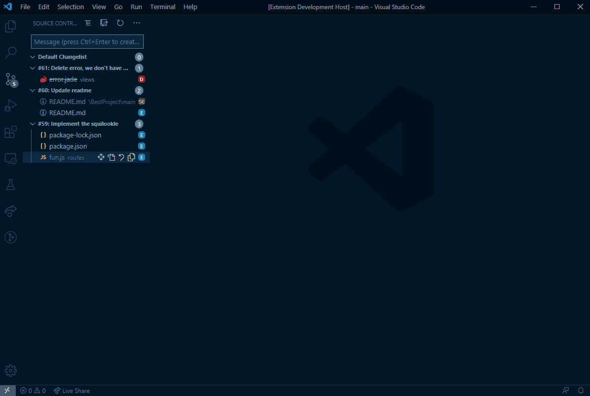
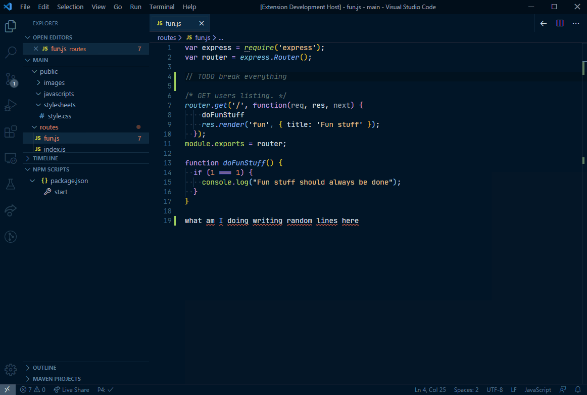
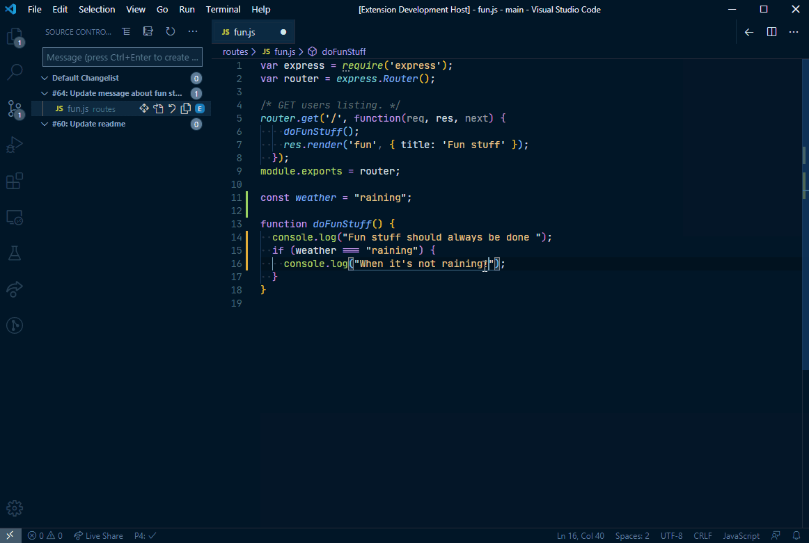
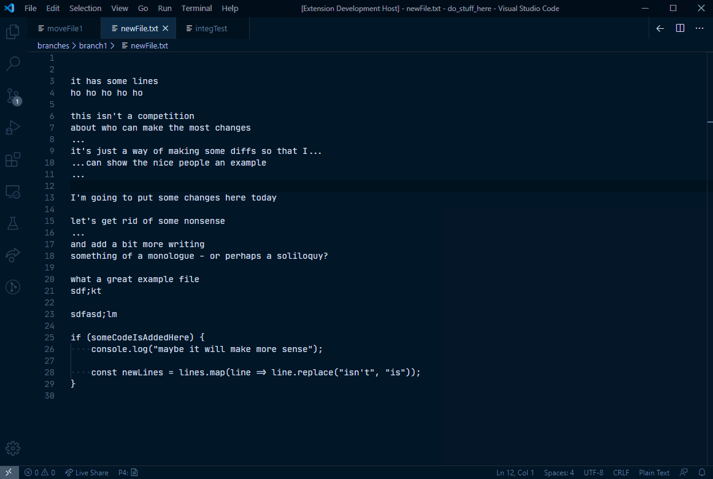
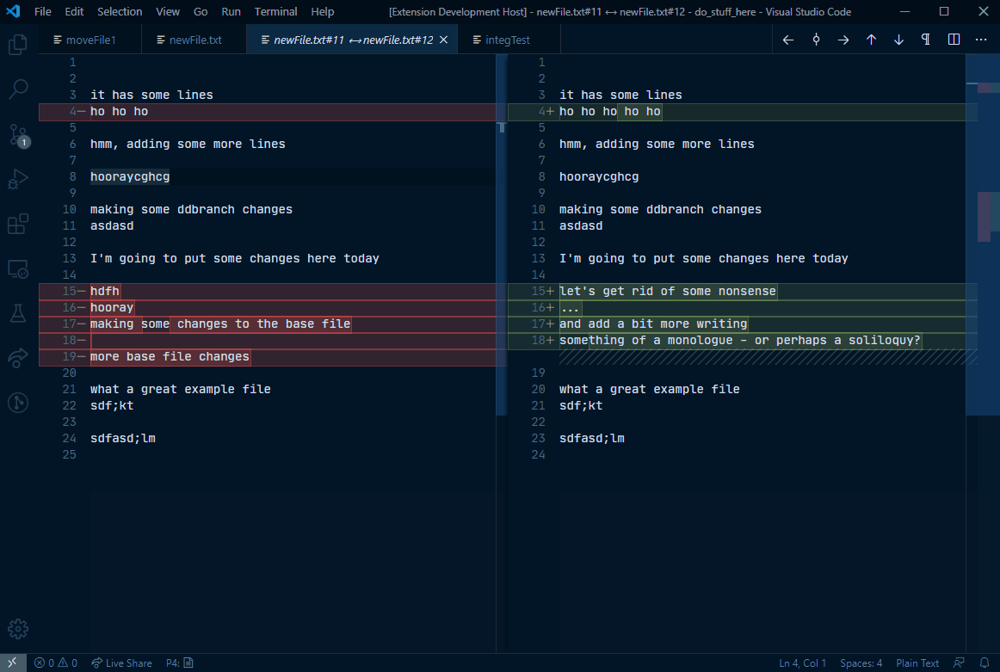
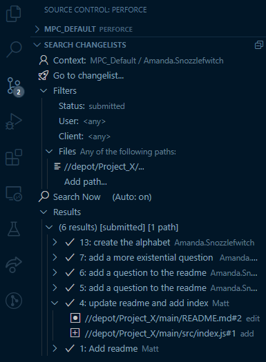

# vscode-perforce

[](https://marketplace.visualstudio.com/items/mjcrouch.perforce)
[](https://github.com/mjcrouch/vscode-perforce/issues)
[](https://github.com/mjcrouch/vscode-perforce/blob/master/LICENSE.txt)  
[](https://dev.azure.com/mjcrouch/vscode-perforce/_build/latest?definitionId=1&branchName=master)
[](https://dev.azure.com/mjcrouch/vscode-perforce/_build/latest?definitionId=1&branchName=master)  
[](https://david-dm.org/mjcrouch/vscode-perforce)
[](https://david-dm.org/mjcrouch/vscode-perforce?type=dev)  

Perforce integration for Visual Studio Code - Now with more features and fixes!

This is a fork of the `slevesque.perforce` extension, published in 2020, as the original creator now appears to be inactive on GitHub.

If you install this extension, please **uninstall or disable** `slevesque.perforce` to prevent issues with duplicate icons and failed commands.

If you are installing for the first time, Proceed to [the setup section](#Setup) for setup instructions.

If you have a working setup from the old extension, it will almost certainly continue to work - There are some unlikely (but possible) breaking changes. If for any reason your setup stops working after switching over, please check [the migration guide](MIGRATION.md) for more help.

## What's included?

### All the features you've come to expect

Built on the foundation of the most installed perforce extension on the market, it has all the core features you already know

### Login & go

If your perforce server requires a password, you can log in from within VS Code


  *Theme: [Night Owl](https://marketplace.visualstudio.com/items?itemName=sdras.night-owl) - Font: [JetBrains Mono](https://www.jetbrains.com/lp/mono/)*

### Integration with VS Code's SCM View

* Create and manage your open changelists from the built in SCM View
* Submit and revert changelists
* Shelve and unshelve files
* Move files between changelists
* Click on an open file to see the diff



### Run common perforce operations on the open file

Click on the 'p4' in the status bar to perform an operation

* `add` - Open a new file to add it to the depot
* `edit` - Open an existing file for edit
* `revert` - Discard changes from an opened file
* `diff` - Display diff of client file with depot file
* `diff revision` - Display diff of client file with depot file at a specific revision
* `login`, `logout` - Login operations
* ... and more!



### Automatically open files for add and edit as you work

* Enable the settings `perforce.editOnFileSave`, `perforce.addOnFileCreate` and `perforce.deleteOnFileDelete` to automatically perform depot operations without that pesky warning dialog

### Diff files in the editor

* Diff the open file against the workspace file
* Diff against any revision of a file
* See diffs as you work with gutter decorations



## What's new in the fork?

The fork has a variety of new features to help you manage your changes and understand your code history, reducing the time spent switching back and forth to p4v or the command line.

We've borrowed ideas from popular extensions like [GitLens](https://marketplace.visualstudio.com/items?itemName=eamodio.gitlens) and... okay, mainly just GitLens, adapting them for the perforce workflow.

And there's still lots of features yet to be implemented, to improve your development experience without getting in the way.

### Improved annotation view

See more context about each line, including the author and the changelist description.



The format of the annotations is customisable in the extension configuration if this is too much information.

### New revision & changelist quick pick

Looking at a diff or annotation? Dive in to the depot with a single click to see some context:

* Browse through revisions and file history
* See integrations into and from the file
* See other files in the same changelist
* Using swarm for reviews? click through to the swarm review
* ... more :)

To open this view, ensure you have a depot revision open (if you are diffing against a local file, click the left hand editor to select the depot revision), then click on the 'commit' icon on the editor title bar:



Or, from an annotated file, hover over an annotation and click the three dots (...) or the changelist number in the message that pops up

[Ideas for improvement? Post feedback here](https://github.com/mjcrouch/vscode-perforce/issues/104)

### Changelist Search

Search for changelists from the SCM view, using the standard set of perforce filters:



Enter the set of filters and click "Search Now" to see or update results. Use auto search to automatically update results when you change the filters

All views can now be dragged to other locations in VS Code - so this can be placed anywhere you like

[Ideas for improvement? Post feedback here](https://github.com/mjcrouch/vscode-perforce/issues/104)

### Improved diff behaviour

* Diffs against the have revision, not the latest revision
  * This includes the gutter decorations - so you'll have an accurate view of what you've actually changed
  * But you can still manually select a newer revision for a diff if needed
* Click through revisions using the left and right arrows
* Diff a shelved file against its depot revision, or the current workspace file
* Automatically diffs a moved file against the original file

### Much more!

Internally, almost every feature has been refactored, rewritten or touched in some way

This fork fixes many issues from the original extension and adds a variety of other new features. A few more examples:

* Automatically creates an SCM provider to manage changelists when you open a file from a different perforce client
* Adds support for attaching jobs to changelists
* Improved support for shelved files & changelists
* Basic support for resolving and re-resolving changelists
* Supports multiple P4CONFIG files in the same workspace
* Adds basic commands such as add / edit / revert / move to the explorer context menu (can be disabled with `perforce.explorer.`... settings)
* Works more reliably with personal servers
* Ability to move selected file from the default changelist to a new changelist

[Head over to the changelog](CHANGELOG.md) to see everything that's changed

But there is still lots more to do. [Feedback](https://github.com/mjcrouch/vscode-perforce/issues)
 and [contributions](CONTRIBUTING.md) are welcome!

## Requirements

* Visual Studio Code v1.46
* The perforce command line client must be installed on your computer
* Access to a perforce server

## Installation

1. Install *[Visual Studio Code](https://code.visualstudio.com/)*
2. Launch *Code*
3. From the command palette `ctrl+shift+p` (Windows, Linux) or `cmd+shift+p` (OS X)
4. Select `Install Extensions`
5. Search for the extension `Perforce for VS Code` by `mjcrouch` (**not** by slevesque)
6. Reload *Visual Studio Code*

Or [visit us on the marketplace](https://marketplace.visualstudio.com/items/mjcrouch.perforce)

## A Couple of Notes

### What's a "Workspace"?
VS Code generally refers to the folder you have open as a "workspace". Meanwhile,
Perforce uses the words "client" and "workspace" in various contexts to mean the mapping of depot paths to client files. Specifically *P4V* refers to perforce clients as "workspaces".

For the avoidance of doubt, in the text below, "workspace" means a VS Code workspace, unless it's preceded by the words "perforce client".

### Creating Perforce Clients
The extension does not provide a way to *create* a perforce client. It only allows you to work with already existing clients. The client mapping from depot paths to local files must first be created using either the command line interface (`p4 client`), or from *P4V*, using `Connection->New Workspace...`

## Setup

You must properly configure a perforce depot area before the extension fully activates and creates a provider in the 'Source Control' area.

If you don't see a perforce SCM provider, it means the extension has not found a valid perforce depot area. A message will be displayed in the SCM view indicating that a perforce client could not be found (unless you have other SCM providers such as git in the same workspace)

Don't forget, if you are tweaking settings, internally or externally, you probably need to restart VS code for the extension to perform this detection again.

#### Having trouble? Output log to the rescue

If you are having trouble, check the **output log** for Perforce. Here, you will be able to see what the extension is trying to do, and what it has found during initialisation

To see the output log, you can run the command "Perforce: Show Output", or you can reach it from `View` -> `Output` and select Perforce in the dropdown. The output relating to initialisation will appear at the top, and will try to warn you of any obvious problems

### **The Best Way**

The best way to setup your perforce workspace is using perforce's own standard behaviour and tools.

The perforce extension works by running the standard p4 command line interface. If you can run perforce commands in your workspace directory without any additional setup, then you *should* in most cases be able to use the perforce extension without extra configuration.

Having your perforce environment set up correctly also makes it possible to run commands and see changelists when you open a file from another folder, not in your workspace or current client - so this method is almost always better than overriding settings within VS Code!

#### The simplest setup

So, in a very simple case, for example where you always work in one particular perforce client, you could:

* Use `p4 set` to set your `P4USER`, `P4PORT`, `P4CLIENT` to the correct values, OR
* Set up your `P4USER`, `P4PORT`, `P4CLIENT` environment variables (e.g. in your `.bashrc` file)
  * Note that updating environment variables may require you to close *all* vscode windows to take effect

If necessary, restart VS Code and it should *just work*™.

#### Multiple perforce clients (P4CONFIG)

If you work across multiple different perforce client workspaces, you can use [P4CONFIG](https://www.perforce.com/perforce/r17.1/manuals/cmdref/index.html#CmdRef/P4CONFIG.html?Highlight=p4config) to set up the different client locations.

Place a file with the right name in the root directory for each client. Typical filenames are as follows:
 * on **windows**: `p4config.txt`
 * on **linux / mac**: `.p4config`

You **must** ensure that your `P4CONFIG` setting has the same filename as the files you are adding. To check, run `p4 set` and look for a line starting with `P4CONFIG=`

If it is not set, you could run `p4 set P4CONFIG=.p4config`, or set the `P4CONFIG` environment variable, to give it the correct value.

The file contents should look like this:

```ini
P4USER=your_user
P4CLIENT=your_client
P4PORT=example.com:1666
```

Restart VS Code and we should be able to detect the client.

Note that perforce config files in lower directories layer on top of files in higher directories and the general environment, so, for example, you can just specify the P4CLIENT if that is the only thing you need to change.

As a simple example, if you want two different clients in your workspace, you can set up your file system like this:

```
my_dev_area/  <── You want to open this directory in VS Code
├── .vscode/
├── not_perforce_stuff/
|   ├── random_file1
|   ├── random_file2
|   ├── ...
├── perforce_area_a/
|   ├── .p4config     <── Place your config for client a here
|   ├── checked_out_file_1
|   ├── ...
├── perforce_area_b/
|   ├── .p4config     <── Place your config for client b here
|   ├── checked_out_file_n
|   ├── ...
```

This will initialise *both* client areas in the SCM view when you open `my_dev_area` in vscode, which will be shown as two "Source Control Providers". You will be able to work on both sets of files.

P4CONFIG can also be useful if you want to open different branches for one product within the same perforce client, independently of each other. As before, create a .p4config at the client root containing the name of your P4CLIENT.

Example file system:
```
product_X/
├── .p4config     <── Place your .p4config or p4config.txt here
├── branches/
│   ├── branch1/
|   |   ├── .vscode/
|   |   ├── src/
|   |   ├── ...
│   ├── branch2/     <── Today, you want to open this directory
|   |   ├── .vscode/
|   |   ├── src/
|   |   ├── ...
├── main/            <── Tomorrow, you want to open this directory
|   ├── .vscode/
|   ├── src/
|   ├── ...
```

Now you can open `branch1`, `branch2` or `main` in their own VS Code windows, and the client will be detected correctly. Or you can open `product_X` and see them all at once.

This reduces the amount of configuration you have to create per workspace.

### **The Fallback Method** (VS Code Configuration)

Can't get it to work, or don't want to create P4CONFIG files?

The following VS Code settings will run all perforce commands using a specific username, client and/or port that you provide:

```json
{
    "perforce.user": "your_user",
    "perforce.client": "your_client",
    "perforce.port": "example.com:1666"
}
```

Remember that VS Code's settings operate in a hierarchy of `user` and `workspace`. These can be placed in the `settings.json` for your workspace, or in your user level settings.

For example, If you set your `perforce.client` in the `user` level of the hierarchy, it will override the perforce client in **all** of your VS Code workspaces / windows - this may be undesirable. If you override the client, you **cannot** then create a P4CONFIG file that uses a different client, and if you open files from a different perforce client, you will **not** be able to run perforce operations on them, because it will run all commands using the manual override.

If you always connect to one server and host, You could set `perforce.user` and `perforce.port` at the `user` level, and then apply the `perforce.client` setting in each workspace.

Don't forget you can also combine these approaches, For example, you can use environment variables for `P4USER` and `P4PORT`, and then just set `perforce.client` in each specific workspace.

### **Multi-root workspaces**

VS Code Multi-root workspaces are supported.

A multi-root workspace is a VS Code term meaning that you have chosen `File->Add Folder to Workspace...` to create a workspace containing multiple folders.

Generally, if your settings work in a given workspace by themselves, they should continue to work in a multi-root workspace. But be aware that the 'workspace' settings are treated slightly differently in a multi-root workspace, which can cause confusion, particularly when converting from a normal workspace to a multi-root.

See the VS Code docs: [Multi-root Workspaces - Settings](https://code.visualstudio.com/docs/editor/multi-root-workspaces#_settings) for more details.

The configuration settings `perforce.user`, `perforce.client`, `perforce.port` and `perforce.password` also support multi-root workspaces, so they can be set at the level of an individual folder within in your multi-root VS Code workspace.

If you have multiple workspaces using different perforce clients, each perforce client will show as a different "Source Control Provider" in the SCM view. If they all use the same perforce client, only one "Source Control Provider" will be created.

### Activation Mode
You can specify how you want the extension to activate by setting the parameter `perforce.activationMode`

* `autodetect` (default)
  * The Source Control Provider and 'P4' status bar icon will only activate if it detects a valid perforce client that contains the workspace root, or a usable `.p4config` file in the workspace
  * If one is not detected, you will be able to view the perforce output log to see why the extension did not activate
  * When you open files outside of the workspace, we attempt to detect the correct perforce client. If this works:
    * You will be able to run commands on those files using the status bar or command palette
    * An SCM provider will be created automatically for that client, unless `perforce.scm.activateOnFileOpen` is disabled
* `always`
  * Always tries to activate the SCM Provider if any perforce client is detected, even if it's in a totally different directory
  * Always activates the 'P4' status bar icon
  * This will allow you to manage changelists in your 'default' client, but is unlikely to be useful for files in the current VS Code workspace
* `off`
  * Don't try to activate SCM Providers
  * No perforce log output will be produced
  * No commands will be registered
  * Effectively, it just disables the extension

## Status bar icons

*  opened for add or edit
*  not opened on this client
*  not under client's root

## Configuration

|Name                               |Type       |Description
|-----------------------------------|-----------|-----------
|`perforce.client`                  |`string`   |Use the specified client
|`perforce.user`                    |`string`   |Use the specified user
|`perforce.port`                    |`string`   |Use the specified protocol:host:port
|`perforce.password`                |`string`   |Use the specified password
|&nbsp; 
|`perforce.editOnFileSave`          |`boolean`  |Automatically open a file for edit when saved
|`perforce.editOnFileModified`      |`boolean`  |Automatically open a file for edit when Modified
|`perforce.addOnFileCreate`         |`boolean`  |Automatically Add a file to depot when Created
|`perforce.deleteOnFileDelete`      |`boolean`  |Automatically delete a file from depot when deleted
|&nbsp; 
|`perforce.dir`                     |`string`   |Overrides any PWD setting (current working directory) and replaces it with the specified directory
|`perforce.command`                 |`string`   |Configure a path to p4 or an alternate command if needed
|`perforce.realpath`                |`boolean`  |**Experimental** Try to resolve real file path before executing command
|&nbsp; 
|`perforce.activationMode`          |`string`   |Controls when to activate the extension (`always`,`autodetect`,`off`)
|`perforce.enableP4ConfigScanOnStartup` | `boolean` | When enabled (default), the extension scans the workspace for `P4CONFIG` files on startup. In large workspaces without `P4CONFIG` files this can be disabled to improve performance
|`perforce.scm.activateOnFileOpen`  | `boolean` | Controls whether the extension attempts to create an SCM provider each time a file outside of a known perforce client workspace is opened
|`perforce.scm.deactivateOnFileClose` | `boolean` | Controls whether an SCM provider is de-activated when there are no more related files or folders open in the editor
|&nbsp;
|`perforce.countBadge`              |`string`   |Controls the badge counter for Perforce (`all`,`off`)
|`perforce.annotate.followBranches` |`boolean`  |Whether to follow branch actions when annotating a file
|`perforce.annotate.gutterColumns`  |`object`   |**Experimental** Format for annotation summary messages
|`perforce.changelistSearch.maxResults` | `number` | The maximum number of results to show in the changelist search
|`perforce.changelistOrder`         |`string`   |Specifies the direction of the changelist sorting (`descending`,`ascending`)
|`perforce.scmFileChanges`          |`boolean`  |Open file changes when selected in SCM Explorer
|`perforce.ignoredChangelistPrefix` |`string`   |Specifies the prefix of the changelists to be ignored.
|`perforce.hideNonWorkspaceFiles`   |`enum`     |Controls how files outside of the current VS Code workspace are shown in the SCM Provider
|`perforce.syncMode`                |`enum`     |Controls whether to sync the whole perforce client or just the VS code workspace when using the default sync command
|`perforce.fileShelveMode`          |`enum`     |Controls behaviour when shelving or unshelving an individual file from the SCM view
|`perforce.hideShelvedFiles`        |`boolean`  |Hide shelved files in the SCM Explorer.
|`perforce.hideEmptyChangelists`    |`boolean`  |Hide changelists with no file in the SCM Explorer.
|`perforce.hideSubmitIcon`          |`boolean`  |Don't show the submit icon next to the changelist description.
|`perforce.promptBeforeSubmit`      |`boolean`  |Whether to prompt for confirmation before submitting a saved changelist.
|`perforce.resolve.p4editor`        |`string`   |Overrides P4EDITOR when running resolve commands
|`perforce.swarmHost`               |`string`   |Specifies the hostname of the Swarm server for annotation links. (`https://localhost`)
|`perforce.editorButtons.diffPrevAndNext`      |`enum`  |Controls when to show buttons on the editor title menu for diffing next / previous
|&nbsp;
|`perforce.explorer.showSyncCommands`|`boolean` |Whether to show commands in the explorer context menu for syncing files and folders
|`perforce.explorer.showBasicOpCommands`|`boolean` |Whether to show commands in the explorer context menu for adding, editing and reverting files
|`perforce.explorer.showFileOpCommands`|`boolean` |Whether to show commands in the explorer context menu for moving files with p4 move
|&nbsp;
|`perforce.bottleneck.maxConcurrent` |`number`  |Limit the maximum number of perforce commands running at any given time.

## Command and Context Variables

The extension provides a few commands and context variables relating to the file currently open in the editor. These can be used in tasks, keyboard shortcuts etc. as required, if you can find a use for them!

For example, the following task prints out the changelist number, provided the current file is open in perforce:

```
    {
        "label": "echo",
        "type": "shell",
        "command": "echo ${command:perforce.currentFile.changelist}"
    }
```

In all cases, the command name and the context variable name are the same

| Name                              | description
|-----------------------------------|---------------
| `perforce.currentFile.status`     | Whether the file is open / in the workspace. Possible values: `OPEN`, `NOT_OPEN`, `NOT_IN_WORKSPACE`
| `perforce.currentFile.depotPath`  | The depot path of the file (**only** provided if the file is open)
| `perforce.currentFile.revision`   | The open revision of the file (**only** provided if the file is open)
| `perforce.currentFile.changelist` | The changelist in which the file is open
| `perforce.currentFile.operation`  | The perforce operation for the file, e.g. `edit`, `move/add`
| `perforce.currentFile.filetype`   | The perforce file type of the file, e.g. `text`

## Common Questions

#### **Q:** Something is not working
**A:** Here are a few steps you should try first:
1. Make sure you have read [the setup section](#Setup)
1. Look at the logs with `Perforce: Show Output`
1. Search for the [existing issue on GitHub](https://github.com/mjcrouch/vscode-perforce/issues?utf8=✓&q=is%3Aissue)
1. If you can't find your problem, [create an issue](https://github.com/mjcrouch/vscode-perforce/issues/new), and please include the logs when possible

#### **Q:** Does it work with Remote-SSH?
**A:** Yes - you will need to install the extension on the remote instance of VSCode, using the normal extensions view

#### **Q:** My perforce server is slow and VS Code shows a read-only file error even with `editOnFileSave` enabled

When you enable `editOnFileSave`, we tell VS Code to delay saving the file until the edit is complete.

However, there is a time limit for this. If you have a slow or distant perforce server, VS Code may time out the save command before your file has become writable.

A special command is available to edit and save in one operation, bypassing VS Code's timeout.

Using this command ensures that the open completes before it tries to save the file.

It's generally not recommended to rebind your ctrl+s keyboard shortcut, due to the small risk that the save never happens if your perforce server never responds, but if you wish, you could rebind your save command like this, to open the file for edit if it's not already open and then save it.

```
{
  "key": "ctrl+s",
  "command": "workbench.action.files.save",
  "when": "perforce.currentFile.status != 'NOT_OPEN'"
}
{
  "key": "ctrl+s",
  "command": "perforce.editAndSave",
  "when": "perforce.currentFile.status == 'NOT_OPEN'"
}
```

## Contributing

[Guide to contributing](CONTRIBUTING.md)

## Acknowledgements

* [Visual Studio Code](https://code.visualstudio.com/)
* Stef Levesque, who created the original extension
* [Contributors, past and present](https://github.com/mjcrouch/vscode-perforce/graphs/contributors)
* [GitLens](https://marketplace.visualstudio.com/items?itemName=eamodio.gitlens) for general inspiration, and also because I use it every day :)
* All the useful tools used, such as
  * [ESLint](https://eslint.org/)
  * [Mocha](https://mochajs.org/)
  * [Chai](https://www.chaijs.com/)
  * [Sinon](https://sinonjs.org/)
  * [Prettier](https://prettier.io/)
  * [Webpack](https://webpack.js.org/)
  * and more!

## License

[MIT](LICENSE.md)
